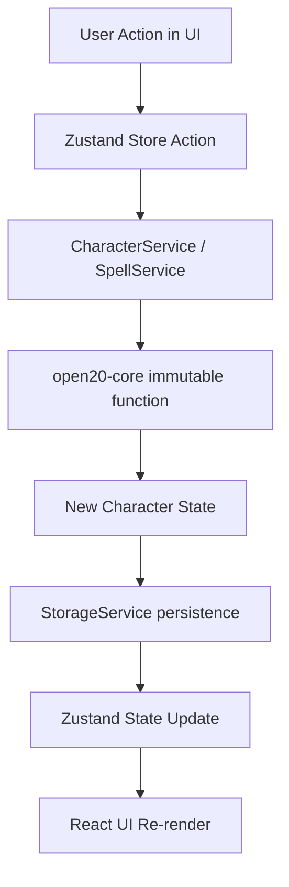

## 4. Core Integration Layer

### 4.1 open20-core API Usage

The core integration layer wraps `open20-core` functions with UI-friendly abstractions. We use the browser-optimized entry point for all runtime operations.

```typescript
// src/core/types.ts
import type { Character } from 'open20-core';

/**
 * Extension of the core Character type with UI-specific metadata
 */
export interface AppCharacter extends Character {
  id: string; // Unique UUID for internal tracking
  // Any other UI-specific fields
}

// src/core/character-service.ts
import {
  createCharacter as open20CreateCharacter,
  prepareSpell as open20PrepareSpell,
  unprepareSpell as open20UnprepareSpell,
  consumeSpellSlot as open20ConsumeSpellSlot,
  recoverSpellSlot as open20RecoverSpellSlot,
  longRest as open20LongRest,
  shortRest as open20ShortRest,
  type CreateCharacterParams
} from 'open20-core';

export class CharacterService {
  /**
   * Create a new character with a unique ID
   */
  static createCharacter(params: CreateCharacterParams): AppCharacter {
    const char = open20CreateCharacter(params, dataLoader);
    return { ...char, id: crypto.randomUUID() };
  }

  /**
   * Prepare a spell for a character
   */
  static prepareSpell(character: AppCharacter, spellId: string): AppCharacter {
    return { ...open20PrepareSpell(character, spellId) as any, id: character.id };
  }

  /**
   * Learn a spell (custom extension not in core)
   */
  static learnSpell(character: AppCharacter, spellId: string): AppCharacter {
    if (character.spells.knownSpells.includes(spellId)) return character;
    return {
      ...character,
      spells: {
        ...character.spells,
        knownSpells: [...character.spells.knownSpells, spellId]
      },
      updatedAt: new Date().toISOString()
    };
  }

  /**
   * Unlearn a spell and ensure it is removed from prepared list
   */
  static unlearnSpell(character: AppCharacter, spellId: string): AppCharacter {
    return {
      ...character,
      spells: {
        ...character.spells,
        knownSpells: character.spells.knownSpells.filter(id => id !== spellId),
        preparedSpells: character.spells.preparedSpells.filter(id => id !== spellId)
      },
      updatedAt: new Date().toISOString()
    };
  }
  
  // ... other methods follow same pattern
}
```

### 4.2 Data Flow Pattern

We follow a unidirectional data flow where the core library remains the source of truth for all game mechanics.



### 4.3 Custom Logic: Spell Sanitization

Since raw SRD data can be inconsistent, `SpellService` performs a sanitization pass:

1.  **Component Parsing**: Normalizes string or object-based components into a standard array `['V', 'S', 'M']`.
2.  **Class Inference**: If a spell lacks a structured `classes` array, the service scans the `description` for keywords (e.g., "Wizard", "Cleric") to automatically categorize the spell.
3.  **Search Indexing**: Pre-processes spells to enable fast real-time filtering by level, school, and caster class.
